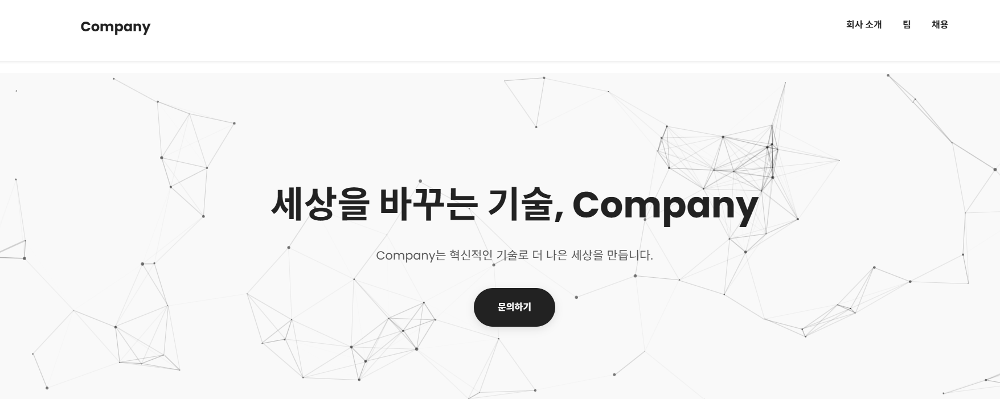

# 회사 홈페이지 (Corporate Website)

### 📸 화면 미리보기

---

### ✨ 주요 기능

#### 👤 회사 소개
* **회사 소개:** 기업의 비전, 미션, 연혁 및 CEO 인사말을 제공합니다.

#### 🎨 디자인 및 사용자 경험 (UX)
* **완전 반응형 디자인:** 모든 기기(모바일, 태블릿, 데스크톱) 해상도에 최적화되어 있습니다.
* **다크/라이트 모드:** 사용자의 시스템 설정에 따른 테마 전환을 지원합니다.
* **부드러운 애니메이션:** 사용자 상호작용 시 자연스러운 화면 전환 및 애니메이션 효과를 적용했습니다.

---

### 🏗️ 기술 스택

| 구분 | 기술 (Technologies) | 설명 |
| :---: | :---: | :---: |
| 🔧 **핵심 기술** | `HTML5` & `CSS3` | 웹 표준 기반의 구조와 스타일링을 담당합니다. |
| 🎨 **스타일링** | `SASS/SCSS` | 체계적인 CSS 관리를 위한 전처리기를 사용했습니다. |
| 💻 **스크립트** | `JavaScript (ES6+)` | 동적인 기능 구현 및 사용자 상호작용을 처리합니다. |
| 🗂️ **프레임워크** | `React / Next.js` | (가정) 단일 페이지 애플리케이션 또는 서버 렌더링을 위한 프레임워크입니다. |

* **상세 기술 목록:**
    * **프론트엔드 핵심:** HTML5, CSS3 (SCSS), JavaScript (ES6+)
    * **라이브러리:** React (또는 Vanilla JS/JQuery), AOS (스크롤 애니메이션 라이브러리)
    * **배포 환경:** GitHub Pages 또는 Netlify (정적 사이트 배포)

---
